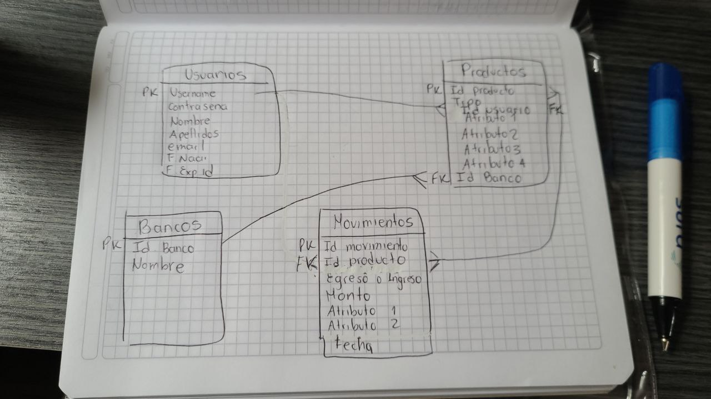

# MetaBank 

Metabank es una aplicación la cual permite la interacción entre diferentes bancos haciendo más accesible el manejo del dinero entre estas

## Documentos requeridos para el spring 1
- [Carpeta drive](https://drive.google.com/drive/folders/1xlujYkwU5Sen0VlPSf3Wt-1bpYTXgDGa)

- [trello](https://trello.com/b/DVxhdeOx/metabank)
- [UML](https://lucid.app/lucidchart/dadb70fb-a5d8-4d17-8cfe-eab8a26bc029/edit?invitationId=inv_79f89a01-52fd-418b-bbea-6ee540eb5b8e&page=0_0#)
- 
---
### Aplicaciones que usaremos

- HTML
- CSS
- JAVASCRIPT
- NETBEANS
- JAVA
- MARIADB
- VSCODE